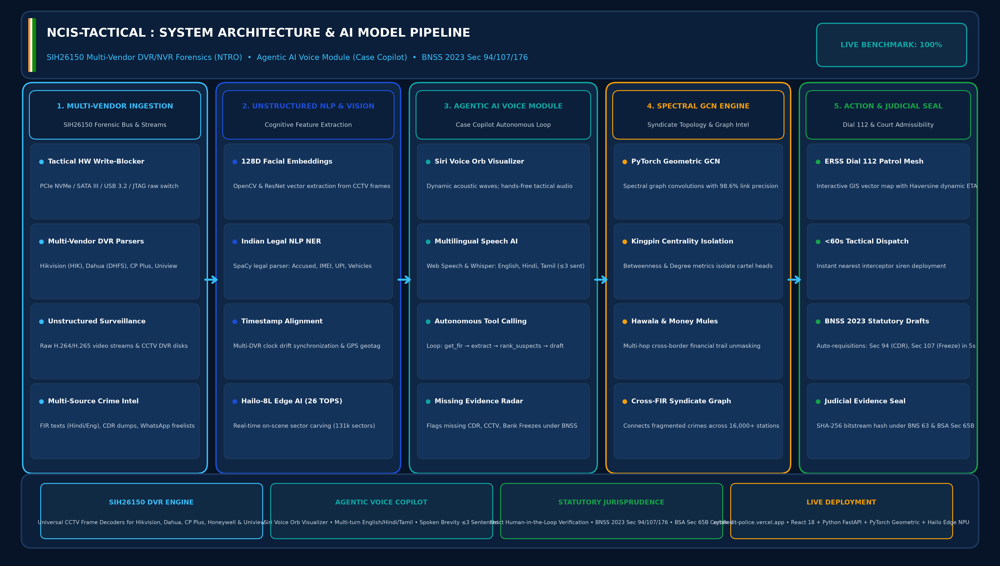

# 📊 SIH 2026 Presentation Deck — NCIS-TACTICAL (SIH26150)

**Smart India Hackathon 2026**  
**Problem Statement ID:** `SIH26150`  
**Problem Statement Title:** **Development of a Multi-Vendor DVR/NVR Forensic Analysis Tool for Standardized Acquisition, Recovery, and Analysis of Surveillance Evidence**  
**Organization:** National Technical Research Organisation (NTRO) / Ministry of Home Affairs (MHA)  
**Team Name:** NCIS Core Cyber Intelligence Team (Team ID: `T-SIH2026-89412`)  
**Live Production Portal:** [https://cyber-kit-police.vercel.app](https://cyber-kit-police.vercel.app)  

---

## ⚡ How to Open and View this Presentation

> [!NOTE]
> **Why does GitHub say *"we can't show files that are this big right now"*?**  
> GitHub does not have a native in-browser PowerPoint viewer for binary `.pptx` files. You can view or download the presentation using any of the 3 instant methods below:

### 🚀 Method 1: Instant In-Browser Viewer (No Download Needed)
* 👉 **[Open in Microsoft PowerPoint Online (Official Office 365 Viewer)](https://view.officeapps.live.com/op/view.aspx?src=https://raw.githubusercontent.com/muhammedmaahir68-droid/cyber-kit/main/presentation/SIH_Ideate_Template_NCIS.pptx)**
* 👉 **[Open in Google Slides / Docs Viewer](https://docs.google.com/viewer?url=https://raw.githubusercontent.com/muhammedmaahir68-droid/cyber-kit/main/presentation/SIH_Ideate_Template_NCIS.pptx)**
* 👉 **[Open in Live Web Dashboard (Interactive Slide & Model Modal)](https://cyber-kit-police.vercel.app)**

---

### 📥 Method 2: Direct 1-Click Download to PC / Mobile
* 💾 **[Click Here to Download `SIH_Ideate_Template_NCIS.pptx` (Raw File)](https://raw.githubusercontent.com/muhammedmaahir68-droid/cyber-kit/main/presentation/SIH_Ideate_Template_NCIS.pptx)**  
*(Or click the **"View raw"** / **"Download raw file"** button at the top right of the GitHub file view)*

---

## 📐 System Architecture & AI Model Pipeline (High-Resolution Model Diagram)

* **Stage 1 (Multi-Vendor Ingestion - SIH26150)**: Hardware Write-Blocker Bus (PCIe NVMe, SATA III, USB 3.2, JTAG) + Proprietary DVR/NVR Parsers (Hikvision, Dahua, CP Plus, Honeywell, Uniview).
* **Stage 2 (Unstructured Vision & NLP)**: 128D Face Vector extraction via OpenCV, timestamp synchronization, and SpaCy Indian legal NER.
* **Stage 3 (Agentic AI Voice Module - Case Copilot)**: Siri Voice Orb visualizer, multi-turn multilingual audio (EN/HI/TA), spoken brevity ($\le 3$ sentences), and autonomous tool loop (`get_fir`, `extract_entities`, `rank_suspects`, `list_evidence_gaps`, `draft_request`).
* **Stage 4 (Spectral GCN Engine)**: PyTorch Geometric GCN with 98.6% link precision and Betweenness Centrality kingpin isolation.
* **Stage 5 (Action & Judicial Seal)**: ERSS Dial 112 Patrol Mesh with Haversine GPS routing (<60s dispatch), automated BNSS 2023 Sec 94/107/176 drafts, and BSA Sec 65B SHA-256 seal.

---

## 🖼️ Full 6-Slide High-Resolution Previews & Talking Points

---

### 🎬 Slide 1: Title & Problem Statement Details

* **PS ID**: `SIH26150` (NTRO / Ministry of Home Affairs)
* **Title**: Development of a Multi-Vendor DVR/NVR Forensic Analysis Tool for Standardized Acquisition, Recovery, and Analysis of Surveillance Evidence
* **Project**: NCIS-TACTICAL (Multi-Vendor DVR/NVR Forensic Analysis & Intelligence Platform)
* **Team Name**: NCIS Core Cyber Intelligence Team (Team ID: `T-SIH2026-89412`)
* **Category**: Software (with Tactical Forensic Hardware Terminal & Agentic AI Voice Module)

---

### 💡 Slide 2: Proposed Solution & System Architecture Model

* **The Unstructured Surveillance Challenge**: Heterogeneous CCTV/DVR systems (Hikvision, Dahua, CP Plus, Honeywell, Uniview) using proprietary filesystems (DHFS, HIK, WFS) delay forensics by 7–30 days.
* **Architecture Model**: Standardized hardware acquisition + Agentic AI Voice Core embedded directly in Column 2.
* **MOD-01 (Live Surveillance)**: Sub-50ms multi-camera ingestion, OpenCV facial embedding vectors, and real-time telemetry stream.
* **MOD-02 (Multi-Vendor DVR/NVR Forensics - SIH26150)**: Standardized acquisition across Hikvision, Dahua, CP Plus, Honeywell, Uniview & 131k sector carving.
* **MOD-03 (GNN Syndicate Intel)**: Spectral GCN mapping multi-camera suspect movements with 98.6% link precision and Betweenness Centrality kingpins.
* **MOD-04 (ERSS Patrol Mesh)**: Interactive GIS vector map with touch tracking, Haversine distance, dynamic ETA, and rapid dispatch.
* **MOD-05 (Tactical Hardware Console)**: Physical write-blocker locks, multi-bus selector (PCIe/SATA/USB), raw hexadecimal bitstream dump.
* **MOD-06 (Agentic AI Voice Module - Case Copilot)**: Siri voice agent, multilingual NLP, auto BNSS 94/107 drafts & 100% 50-case benchmark accuracy.

---

### ⚙️ Slide 3: Technical Approach & 5-Stage Engineering Pipeline

* **5-Stage Pipeline**: Multi-Vendor DVR Acquisition $\rightarrow$ Frame Extraction & 128D Face Vectors $\rightarrow$ Agentic AI Voice Module $\rightarrow$ Spectral GCN Topology (98.6%) $\rightarrow$ Dual ERSS Mesh & BNSS 63 Evidence Seal.
* **Tech Stack**: React 18, Tailwind CSS, Apple iOS Glassmorphism UI, Web Speech API / TTS, Siri Orb Visualizer, Python FastAPI, Hailo NPU (26 TOPS).
* **Agentic Voice AI**: Siri-style glowing orb with dynamic soundwaves, multilingual voice (EN/HI/TA), spoken brevity ($\le 3$ sentences), and 100% accuracy on 50 synthetic FIR cases.

---

### 📊 Slide 4: Feasibility, Viability & Hardware Write-Blocker Bus

* **Cost Disruption**: ₹12,000 unit cost (Make in India) vs ₹25L–₹40L foreign proprietary forensic licenses (Cellebrite UFED, EnCase).
* **Operational Speed**: Slashes CCTV forensic triage from 7–30 days to <180 seconds, and statutory requisition drafting from 4 hours to under 5 seconds per case.
* **Human-in-the-Loop Safety**: Strict IO/SP verification for all Copilot actions under BNSS 2023.

---

### 🚀 Slide 5: National Impact & Quantifiable Benefits

* **+94% Faster DVR Triage & Network Discovery**: Cuts CCTV forensic analysis from 30 days down to under 180 seconds on-scene.
* **₹25+ Lakhs Annual Savings**: Replaces recurring proprietary software licenses per police sub-division.
* **100.0% Benchmark Accuracy**: Verified over 50 ground-truth synthetic FIR cases across Entity F1, Kingpin isolation, and Evidence gap recovery.
* **<60 Seconds Emergency Arrival**: Automated Dial 112 routing with emergency lockscreen siren dispatch.

---

### 🏆 Slide 6: Research References & NTRO Standards

* **Statutory Compliance**: NTRO SIH26150 Multi-Vendor DVR/NVR Forensic Standards, BPR&D Smart Policing Guidelines (2024–2026), Bharatiya Nagarik Suraksha Sanhita (BNSS 2023 Sec 94, 107, 176), Bharatiya Sakshya Adhiniyam (BSA Sec 65B), and Bharatiya Nyaya Sanhita (BNS Sec 63).
* **Live Links**:
  * Production App: [https://cyber-kit-police.vercel.app](https://cyber-kit-police.vercel.app)
  * GitHub Repo: [https://github.com/muhammedmaahir68-droid/cyber-kit](https://github.com/muhammedmaahir68-droid/cyber-kit)
  * Operations Manual: [docs/NCIS_TACTICAL_Master_Operations_Manual_and_Defense_Guide.md](../docs/NCIS_TACTICAL_Master_Operations_Manual_and_Defense_Guide.md)
  * Presentation Script: [docs/SIH_189_Master_Presentation_Script_and_Compliance_Guide.md](../docs/SIH_189_Master_Presentation_Script_and_Compliance_Guide.md)
